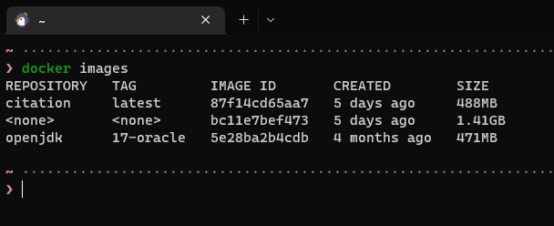

# Getting started

citationは、メッセージリンクのプレビューをEmbedで表示するDiscord Botです。

前代の [MessageQuote](https://github.com/m2en/MessageQuote) で見つかった問題点を解決するのを目的にプログラミング言語 **[Kotlin](https://kotlinlang.org/)** で再実装しています。

Dockerの環境があればすぐに用意ができるようになっています。さあ、貴方のギルドにcitationを構築しましょう!

## citationを利用するには

citationは以下の方法で利用できます。

1. ghcr.io(GitHub Packages)に用意されているビルド済みイメージを利用する (推奨)
2. 自分でビルドする


!!! warning "citationを自分でビルドする際の注意点"

    citationは以下の環境を要求します。
    Dockerで構築する場合はそもそものイメージ内に含まれているので考える必要がありませんが、自分でビルドを行う際は確認・用意が必要です。

    - Java 17

    なお、Gradleについてはデーモン(Wrapper)が付属しています。

----

=== "ghcr.io(GitHub Packages)"

    ここではghcr.io(GitHub Packages)にプッシュされているビルド済みイメージを利用する方法を説明します。

    **1. Dockerの環境を構築する**

    [Orientation and setup - Docker Documentation](https://docs.docker.com/get-started/) を参照しながらご自身のPC、またはサーバーにDockerを構築してください。

    **2. イメージを取得する**

    以下のコマンドを実行し、イメージを取得してください。

    ```bash
    docker pull ghcr.io/m2en/citation:latest
    ```

    **3. 環境変数を作成する**

    適当なディレクトリを作成し `.env` ファイルを作成し、 [GitHubの `.env.example` ファイル](https://github.com/m2en/citation/blob/main/.env.example) を参考に環境変数を設定してください。

    ```.env
    # citationが接続するクライアントユーザーのトークン (Required)
    CITATION_BOT_TOKEN=

    # citationのコマンドを登録するギルドのID (Optional)
    GUILD_ID=
    ```

    **4. コンテナを起動する**

    以下のコマンドを実行し、citationのイメージIDを確認してください。

    ```bash
    docker images
    ```

    

    この場合のイメージIDは `87f14cd65aa7` です。

    `.env` を作成したディレクトリに移動し次のコマンドを実行します。

    ```bash
    docker run --env-file .env -t 87f14cd65aa7
    ```

    ハッシュ値が表示されたら成功です。お疲れ様でした。

=== "自身でビルド"

    次のコマンドを実行し、citationをビルドしてください。

    ```bash
    # ssh
    git clone git@github.com:m2en/citation.git

    # https
    git clone https://github.com/m2en/citation.git

    cd citation

    ./gradlew shadowJar
    ```

    適当なディレクトリを作成し `.env` ファイルを作成し、 [GitHubの `.env.example` ファイル](https://github.com/m2en/citation/blob/main/.env.example) を参考に環境変数を設定してください。

    ```.env
    # citationが接続するクライアントユーザーのトークン (Required)
    CITATION_BOT_TOKEN=

    # citationのコマンドを登録するギルドのID (Optional)
    GUILD_ID=
    ```

    `.env` をcitationのルートディレクトリ上に設置し、次のコマンドを実行します。

    ```bash
    java -jar build/libs/citation.jar
    ```

    `citation ready!` と表示されたら成功です。お疲れ様でした。

----

## コマンドを登録する

citationの引用機能は起動するだけで利用可能ですが、ヘルプコマンドなどの拡張機能を使う場合はコマンド作成が必要です。

`.env` にて `GUILD_ID` をパスとしてギルドIDを登録してください。

登録したら、 Botを起動して登録したギルドで `!register` を実行します。

!!! info "!register を実行できるメンバー"

    `!register` を実行できるメンバーは以下の権限を取得しておく必要があります。

    - `ManageServer` (サーバーの管理権限)
    
    または

    - `Administrator` (管理権限)

    サーバー所有者であっても、 上記権限を持っていないと実行できません。

## citationに必要な権限

citationが接続するクライアントユーザーに必要な権限は以下の通りです。

- `Send_Messages` (メッセージの送信権限)
- `Send_Messages_in_Threads` (スレッドでのメッセージ送信権限)
- `Embeds_Links` (リンクの埋め込み権限)
- `Add_Reactions` (リアクション付与権限)

!!! warning "Administator権限は付与しないでください"

    `Administrator` 権限は非常に強い権限です。

    サーバー所有者とほぼ同等の権限を持つため、万が一トークンが漏洩した場合、不正利用される可能性があり危険です。

    (サーバーのメンバーを全員BANし、再起不能にする荒らし 通称 `Server-Nuke` に悪用される場合があります)
