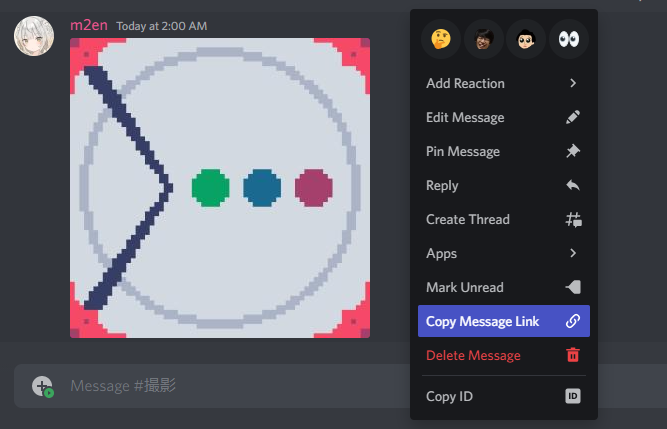
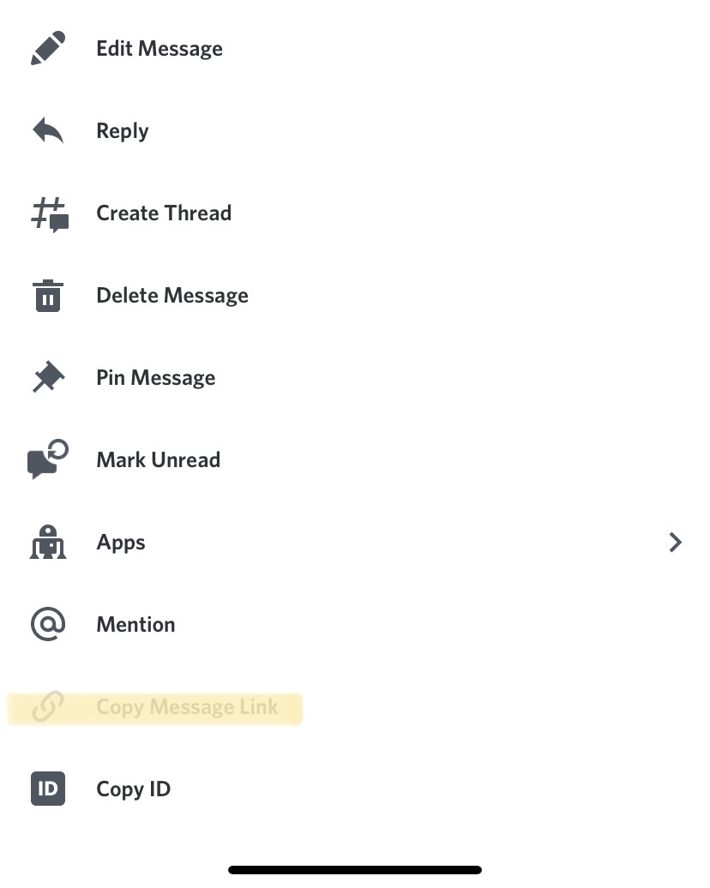
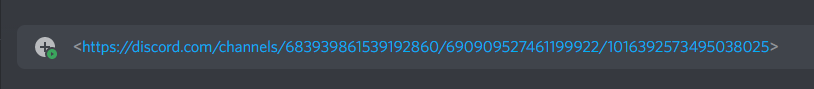

# Quote / 引用機能

citation は引用機能を提供します。

## メッセージを引用する

メッセージを引用するには引用したいメッセージのメッセージリンクをコピーし、それをチャンネルに送るだけです。

!!! info "引用できないチャンネル"

    citationが以下の権限を持たないチャンネルでは引用機能を利用できません。

    - `VIEW_CHANNEL` (チャンネル閲覧権限)
    - `MESSAGE_SEND` (メッセージ送信権限)

    また、`VIEW_CHANNEL` (チャンネル閲覧権限) をもっていないチャンネルのメッセージにはアクセスできない点に注意してください。

=== "Desktop版(Windows/Mac/Linux)・ブラウザ版"

    メッセージを右クリックし、`メッセージリンクをコピー`(`Copy Message Link`)をクリックします。

    

=== "スマートフォン版・タブレット版(Android/iOS)"

    メッセージを長押しし、`メッセージリンクをコピー`(`Copy Message Link`)をタップします。

    

!!! example

    `https://discord.com/channels/<GuildId>/<ChannelId>/<MessageId>`

## メッセージを引用せず無視させる

メッセージリンクだけ送りたい場合は、メッセージリンクを `<>` で挟むだけです。

!!! example

    `<https://discord.com/channels/683939861539192860/690909527461199922/1016392573495038025>`

## 引用を削除する

!!! warning "バージョンに関する警告"

    以下の機能は [`v1.1.0`](https://github.com/m2en/citation/releases/tag/v1.1.0) 以降で利用できる機能です。

自分のメッセージリンクの引用は `🗑`(`:wastebasket:`) リアクションを送信して削除することができます。

自分の引用ではない場合は削除できません。

## スレッドでの引用

citationはスレッド / VoiceChannel in TextChannel での引用にも対応しています。

パブリックスレッドの場合はメッセージリングを自動で検知して引用します。

プライベートスレッドの場合はメンションでそのスレッドに招待する必要がある点に注意してください。

## NSFWコンテンツの引用

NSFWチャンネルのコンテンツをNSFWチャンネル以外で引用することはできません。

NSFWチャンネルのコンテンツをNSFWチャンネルで引用することは可能です。

## 引用できないメッセージ

citationは以下のメッセージは引用できません。

- システムメッセージ
    - 例:
    - ギルド参加通知
    - ブースト通知
    - スレッド作成通知
    - スレッド名変更通知
    - スレッド追放通知
    - など
- 音声ファイル
- 動画ファイル
- スタンプ(Sticker)
- citationが参加していないサーバーの絵文字
- メッセージファイル
